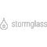

#  Storm Glass Marine Weather **flow**ground Connector

## Description

A generated **flow**ground connector for the Storm Glass Marine Weather API (version 1.0.1).

Generated from: https://api.apis.guru/v2/specs/stormglass.io/1.0.1/swagger.json 
Generated at: 2019-05-07T17:44:15+03:00

## API Description

Global marine weather data from multiple sources in one single API with hourly resolution. Get your API key by visiting the Storm Glass web site.

## Authorization

Supported authorization schemes:
- API Key
## Actions

### Get hourly forecasts by coordinates

> Get forecast info for the given coordinates. For every hour and property, you will get a list of weather sources and their values.

*Tags:* `forecast`

#### Input Parameters
* `lat` - _required_ - The latitude for a location. Valid input is a number between -90 and 90.
* `lng` - _required_ - The longitude for a location. Valid input is a number between -180 and 180.

## License

**flow**ground :- Telekom iPaaS / stormglass-io-connector 
Copyright © 2019, [Deutsche Telekom AG](https://www.telekom.de) 
contact: flowground@telekom.de

All files of this connector are licensed under the Apache 2.0 License. For details
see the file LICENSE on the toplevel directory.
